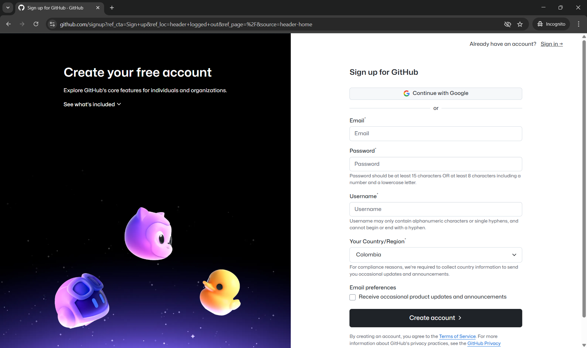
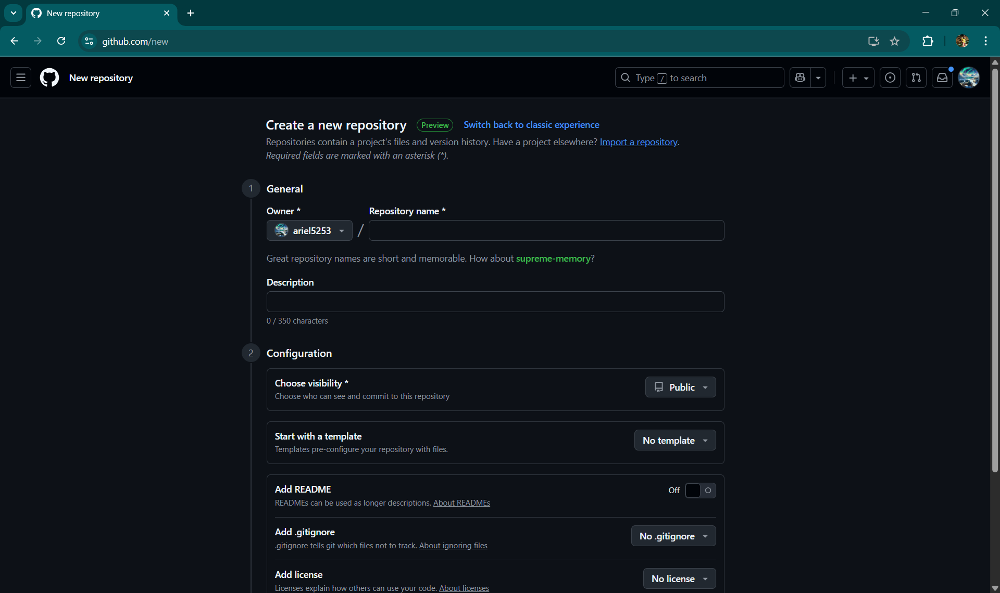
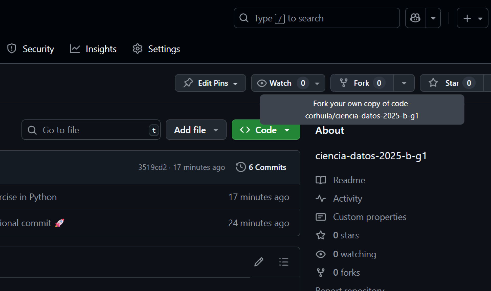
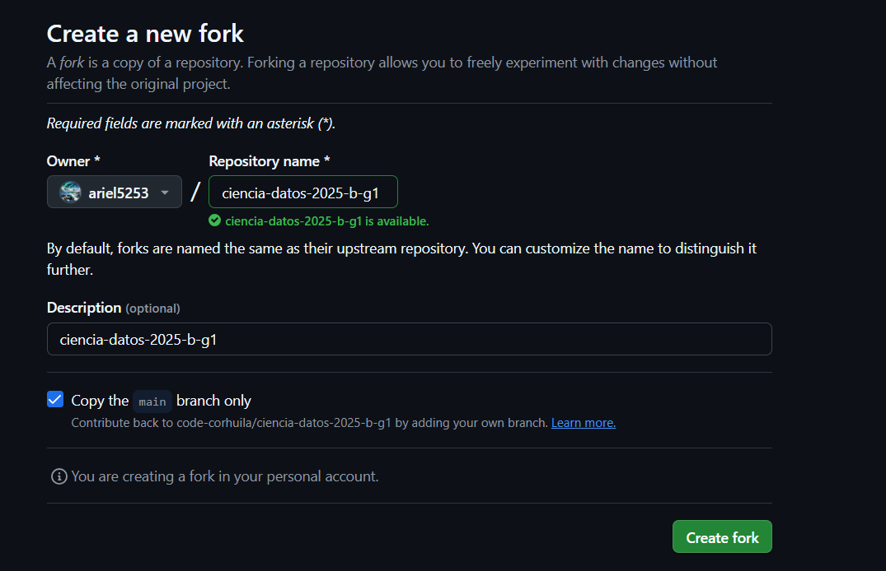
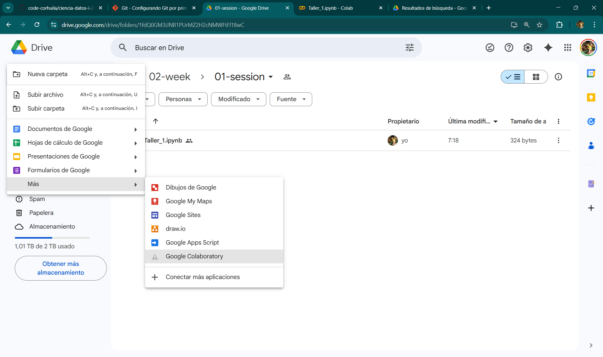
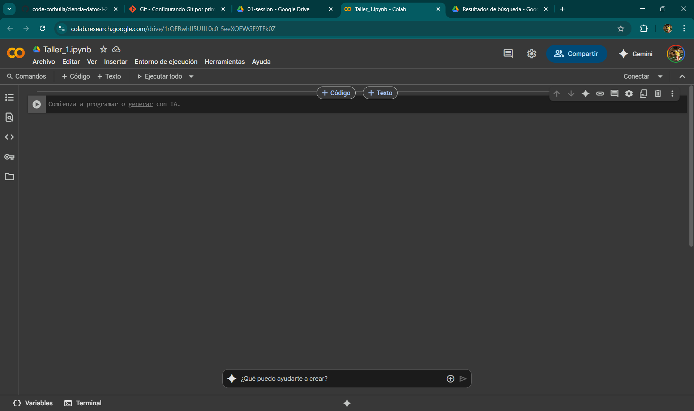

# 1. Introducción a Git

Git es una herramienta fundamental para el control de versiones en proyectos de programación y ciencia de datos. A continuación se describen los pasos básicos para comenzar a utilizarlo:

## 1.1. Registro en GitHub

Para empezar, debes crear una cuenta en [GitHub](https://github.com). Este proceso es sencillo y solo requiere un correo electrónico válido.



## 1.2. Creación de repositorios

Puedes crear repositorios según tus necesidades. Un repositorio es el espacio donde se almacenan los archivos y el historial de cambios de tu proyecto.



**Nota:** Para la materia Ciencia de Datos, debes realizar un *fork* del repositorio oficial: [`https://github.com/code-corhuila/ciencia-datos-2025-b-g1.git`](https://github.com/code-corhuila/ciencia-datos-2025-b-g1.git)

## 1.3. Realizar Fork

El *fork* te permite crear una copia del repositorio en tu cuenta de GitHub para trabajar de manera independiente.




---

# 2. Uso de Git en local (PC) — Aplica para corte 3

Si deseas trabajar en tu computador, sigue estos pasos:

### 2.1. Instalar Git

Descarga e instala Git desde [git-scm.com](https://git-scm.com).

### 2.2. Configuración inicial y autenticación

Configura tu usuario y correo electrónico para que tus cambios queden registrados correctamente:

```bash
# Configura tu nombre de usuario
 git config --global user.name "John Doe"
# Configura tu correo electrónico
 git config --global user.email johndoe@example.com
```

Verifica que la credencial del usuario esté correctamente configurada ejecutando:

```bash
 git config --list
```

### 2.3. Trabajo en Colab y VSCode

Puedes trabajar tanto en Google Colab como en VSCode, según tus preferencias y necesidades.




---

# 3. Uso de VSCode

VSCode es un editor de código muy popular que facilita la integración con Git y GitHub, permitiendo gestionar tus proyectos de manera eficiente.